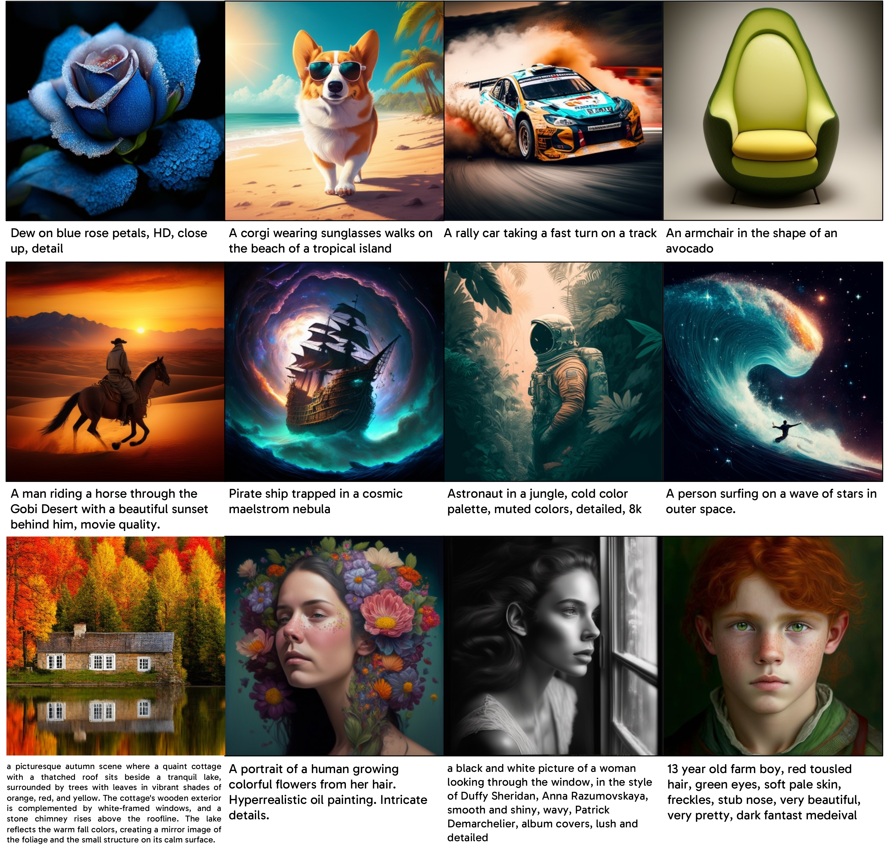

<div align="center" style="font-family: charter;">
<h1>Exploring the Deep Fusion of Large Language Models and Diffusion Transformers for Text-to-Image Synthesis</h1>


<a href="https://arxiv.org/pdf/2505.10046" target="_blank">
    </a>
<a href="https://huggingface.co/ooutlierr/fuse-dit" target="_blank">
    </a>
<div>
    <a href="https://tang-bd.github.io/" target="_blank">Bingda Tang</a><sup>1</sup>,</span>
    <a href="https://www.boyangzheng.com/academica/" target="_blank">Boyang Zheng</a><sup>1</sup>, </span>
    <a href="https://xichenpan.com" target="_blank">Xichen Pan</a><sup>1</sup>,</span>
    <a href="https://sayak.dev/" target="_blank">Sayak Paul</a><sup>2</sup>,</span>
    <a href="https://www.sainingxie.com/" target="_blank">Saining Xie</a><sup>1</sup></span>
</div>

<div>
    <sup>1</sup>New York University&emsp;
    <sup>2</sup>Hugging Face&emsp;
</div>
<br>


</div>

## Contents
- [Setup](#setup)
- [Data Preparation](#data-preparation)
- [Training](#training)
- [Inference](#inference)
- [Evaluation](#evaluation)
- [Citation](#citation)
- [Contact](#contact)
- [Acknowledgements](#acknowledgements)

## Setup

Create a virtual environment (Python~=3.10):

```bash
conda create -n fuse-dit python=3.10
conda activate fuse-dit
```

Clone the repository:

```bash
git clone https://github.com/tang-bd/fuse-dit.git
cd fuse-dit
```

Install the dependencies:

```bash
pip install -r requirements.txt
```

For TPU devices, additionally install PyTorch/XLA (~=2.5.0):

```bash
pip install torch~=2.5.0 'torch_xla[tpu]~=2.5.0' \
-f https://storage.googleapis.com/libtpu-releases/index.html \
-f https://storage.googleapis.com/libtpu-wheels/index.html
```

## Data Preparation

### CC12M

Download the [dataset](https://huggingface.co/datasets/pixparse/cc12m-wds) and [synthetic captions](https://huggingface.co/datasets/CaptionEmporium/conceptual-captions-cc12m-llavanext), then merge them into WebDataset `.tar` format:

```bash
python utils/process_cc12m.py --dataset_path /path/to/dataset/ \
--captions_path /path/to/synthetic/captions/ --output_dir /output/dir/
```

### SA-1B

Download the [text file containing the dataset links](https://ai.meta.com/datasets/segment-anything-downloads/), then use the provided script to download the full dataset:

```bash
python utils/download_sa1b.py --input_file /path/to/sa1b/links \
--raw_dir /downloaded/files/dir/ --images_dir /extracted/files/dir/
```

Download the [synthetic captions](https://huggingface.co/datasets/PixArt-alpha/SAM-LLaVA-Captions10M), then merge them with the full dataset into WebDataset `.tar` format:

```bash
python utils/process_sa1b.py --dataset_path /extracted/files/dir/ \
--captions_path /path/to/synthetic/captions/ --output_dir /output/dir/
```
### JourneyDB

Download the [dataset](https://huggingface.co/datasets/JourneyDB/JourneyDB/tree/main) and convert it into WebDataset `.tar` format:

```bash
python utils/clean_journeydb.py \
--input_path /path/to/dataset/data/train/train_anno_realease_repath.jsonl \
--output_dir /output/dir
python utils/process_journeydb.py \
--dataset_path /path/to/dataset/data/train/imgs \
--output_dir /output/dir
```

## Training

### TPU

To ensure reproducibility, we recommend training on TPU devices. The research experiments were conducted using TPU v4-256 pods.

``` bash
gcloud alpha compute tpus queued-resources create <your-tpu-pod> --node-id=<your-tpu-pod> \
--zone=<your-zone> \
--project=<your-project> \
--accelerator-type=v4-256 \
--runtime-version=tpu-ubuntu2204-base \
--best-effort
```

To launch training on TPU devices:

```bash
gcloud alpha compute tpus tpu-vm ssh <your-tpu-pod> --worker=all --command=" \
export XLA_USE_SPMD=1; export XLA_DISABLE_FUNCTIONALIZATION=1; \
export PT_XLA_DEBUG_LEVEL=1; cd fuse-dit; \
python train.py -c /training/config.yaml"
```

Configuration files used in the research experiments are provided in [configs](configs). For local training, adapt these files to suit your environment. Note that for TPU devices, the `batch_size` parameter is specified per node, not per chip.

### GPU

To launch training on GPU devices:

```bash
deepspeed train.py -c /training/config.yaml
```

Additional DeepSpeed configuration is required for multi-node training.

## Inference

Before running inference, convert the trained model checkpoint into diffusers pipeline format:

```bash
python utils/save_pipeline.py --checkpoint /path/to/checkpoint/ \
--trainer <model-trainer> --type <model-type> --compression
```

- `<model-trainer>`: `spmd` (TPU) or `deepspeed` (GPU), based on the training setup.
- `<model-type>`: `baseline-dit` or `fuse-dit`, depending on the model architecture.

For convenience, our pre-trained model can be downloaded directly [here](https://huggingface.co/ooutlierr/fuse-dit) as well.

Example inference code is provided in [inference.py](inference.py):

```bash
python inference.py --checkpoint_path /path/to/pipeline/ --prompt "your prompt" \
--resolution 512 \
--num_inference_steps 25 \
--guidance_scale 6.0 \
--save_path /save/path.jpg
```

## Evaluation

### GenEval

Follow the instructions in the [official GenEval repository](https://github.com/djghosh13/geneval) to set up the benchmark, and use the provided script with appropriate configuration to sample images. 

```bash
accelerate launch evaluation/sample_geneval.py evaluation/geneval.yaml
```

Then follow the official instructions to evaluate the sampled images.

### DPG-Bench

Follow the instructions in the [official DPG-Bench repository](https://github.com/TencentQQGYLab/ELLA) to set up the benchmark, and use the provided script with appropriate configuration to sample images.

```bash
accelerate launch evaluation/sample_dpgbench.py evaluation/dpgbench.yaml
```

Then follow the official instructions to evaluate the sampled images.

### FID

Download the [MJHQ-30K dataset](https://huggingface.co/datasets/playgroundai/MJHQ-30K), and use the provided script with appropriate configuration to sample images.

```bash
accelerate launch evaluation/sample_mjhq.py \
--checkpoint /path/to/pipeline/ \
--model_type <model-type> \
--prompts /path/to/mjhq/meta_data.json \
--resolution 512 \
--num_inference_steps 25 \
--guidance_scale 6.0 \
--batch_size <batch-size> \
--save_dir /save/dir/
```

Then compute the FID score:

```bash
python evaluation/fid.py --real_images /path/to/mjhq/imgs/ --fake_images /save/dir/
```

## Citation

If you find our work useful for your your research and applications, please cite using this BibTeX:

```bibtex
@article{tang2025exploringdeepfusion,
    title={Exploring the Deep Fusion of Large Language Models and Diffusion Transformers for Text-to-Image Synthesis}, 
    author={Bingda Tang and Boyang Zheng and Xichen Pan and Sayak Paul and Saining Xie},
    year={2025},
    journal={arXiv preprint arXiv:2505.10046}, 
}
```

## Contact

If you have any questions or suggestions, please feel free to contact: tangbd2003@gmail.com.

## Acknowledgements

We also thank Shusheng Yang, Shengbang Tong, Wenhao Chai, Nanye Ma, Sihan Xu, and Chenyu Li for insightful discussions. This work was mainly supported by the Google TPU Research Cloud (TRC) program, the Google Cloud Research Credits program (GCP19980904), Open Path AI Foundation, and Lambda Labs.
